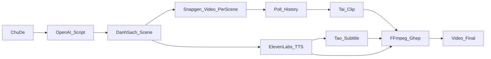

# Plan: Electron AI Video Studio (multi-scene)

> Trạng thái: **đã triển khai** · Build package: `npm run package` (win32 x64) · Cập nhật: 2026-07-30

## Tổng quan

Xây dựng ứng dụng Electron (React + TypeScript) trong repo Snapgen docs, pipeline nhiều cảnh:

**ChatGPT viết kịch bản → gen từng clip qua toàn bộ model Snapgen → ElevenLabs voice + subtitle → ghép bằng ffmpeg**

API keys cấu hình trên UI (không cần `.env`).

## Bối cảnh

Repo ban đầu chỉ có docs Snapgen (`openapi.json`, `content/`). Scaffold app Electron trong cùng repo, giữ docs làm tham chiếu API.

**Quyết định đã chốt:**

- Hỗ trợ **tất cả** model video Snapgen
- Pipeline **nhiều cảnh** (ChatGPT chia scene → gen từng clip → ghép local + voice/subs ElevenLabs)

## Stack

- **Electron Forge** + **Vite** + **React** + **TypeScript** ([Electron docs](https://www.electronjs.org/docs/latest))
- Main process: gọi API, lưu key, ffmpeg, download file
- Preload + `contextBridge` IPC (không expose Node trực tiếp cho renderer)
- `safeStorage` + file store local cho API keys trên UI
- `fluent-ffmpeg` + binary `ffmpeg-static` để concat clip, mux audio, xuất SRT

## Pipeline sản phẩm



1. User nhập chủ đề / brief + chọn **family model** (Veo / Sora / Grok / Seedance / Kling / Meta) và variant cụ thể.
2. **OpenAI ChatGPT** trả JSON: `title`, `narration`, `scenes[]` với `visual_prompt`, `narration_segment`, `duration_hint`.
3. User chỉnh kịch bản trên UI (sửa prompt từng scene, thêm/xóa scene).
4. Với mỗi scene: `POST` endpoint Snapgen → nhận `uuid` → poll `GET /uapi/v1/history/{uuid}` đến `status === 2`.
5. Download URL media từ history → thư mục project local.
6. **ElevenLabs**: TTS narration + timestamps/alignment → file `.srt`.
7. **FFmpeg**: normalize clip theo audio, concat, gắn audio, soft-sub / burn-in.
8. Preview trong app + Export / Save As.

Grok Storyboard API **không dùng làm path chính** — thống nhất mọi model bằng gen từng scene rồi ghép local.

## Cấu trúc thư mục

```
snap-gen-ai/
  content/                 # docs API (giữ nguyên)
  openapi.json
  package.json
  forge.config.ts
  PLAN.md                  # file này
  src/
    main/
      index.ts             # BrowserWindow, IPC handlers
      store.ts             # keys + settings
      services/
        openai.ts          # tạo kịch bản
        snapgen.ts         # wrapper mọi video endpoint + poll
        elevenlabs.ts      # TTS + timestamps → SRT
        ffmpeg.ts          # concat / mux / subs
        pipeline.ts        # orchestration job
    shared/
      models.ts            # catalog model + param constraints
      types.ts
      ipc.ts
    preload/
      index.ts
    renderer/
      App.tsx
      pages/
        Studio.tsx         # wizard: Idea → Script → Generate → Result
        Settings.tsx       # nhập 3 API keys
      components/
        ModelPicker.tsx
        SceneEditor.tsx
        JobProgress.tsx
        VideoPreview.tsx
```

## Tích hợp API

### Keys trên UI (Settings)

| Key | Dùng cho |
|-----|----------|
| Snapgen `x-api-key` | Video gen + history + account credits |
| OpenAI API key | ChatGPT script |
| ElevenLabs API key | Voice + alignment/subs |

Lưu encrypted qua `safeStorage` khi hệ thống hỗ trợ; không bắt buộc `.env`.

### Snapgen video endpoints

| Family | Endpoint |
|--------|----------|
| Veo | `POST /uapi/v1/video-gen/veo` |
| Sora | `POST /uapi/v1/video-gen/sora` |
| Grok | `POST /uapi/v1/video-gen/grok` |
| Seedance | `POST /uapi/v1/video-gen/seedance` |
| Kling | `POST /uapi/v1/video-gen/kling` |
| Meta | `POST /uapi/v1/video-gen/meta` |

Poll: `GET https://api.snapgen.ai/uapi/v1/history/{uuid}` — status `1` processing, `2` done, `3` fail.

### OpenAI script

`chat.completions` (mặc định `gpt-4o-mini`, chọn được trên Settings), output JSON schema scenes. Duration hint clamp theo model.

### ElevenLabs

- TTS `with-timestamps` → map alignment → `.srt`
- Voice ID chọn được trên Settings

## UI (MVP)

Wizard 4 bước:

1. **Idea** — brief, ngôn ngữ narration, model picker, aspect ratio
2. **Script** — hiển thị/sửa scenes + narration
3. **Generate** — progress từng scene + TTS + merge
4. **Result** — preview, export video + SRT, mở folder

Settings: 3 API keys + test connection (Snapgen `/uapi/v1/account`, OpenAI, ElevenLabs).

## Phạm vi

**Trong MVP:** multi-scene text-to-video, mọi family model chính, voice + sub, ghép ffmpeg, keys trên UI, project local.

**Ngoài MVP:** image-to-video / ref images đầy đủ, Kling motion control, extend APIs, webhook, Grok storyboard native, installer signed.

## Checklist triển khai

- [x] Scaffold Electron Forge + Vite + React + TypeScript
- [x] Settings UI + safeStorage cho Snapgen, OpenAI, ElevenLabs keys
- [x] Client Snapgen: catalog model, generate, poll history, download clip
- [x] OpenAI ChatGPT tạo kịch bản JSON đa scene + SceneEditor UI
- [x] ElevenLabs TTS + timestamps → SRT
- [x] FFmpeg concat clips, mux audio, gắn subtitle
- [x] Wizard Studio end-to-end + progress + preview/export
- [x] `npm run package` (win32 x64)

## Chạy app

```bash
npm install
npm start          # dev
npm run package    # build ra thư mục out/
```
